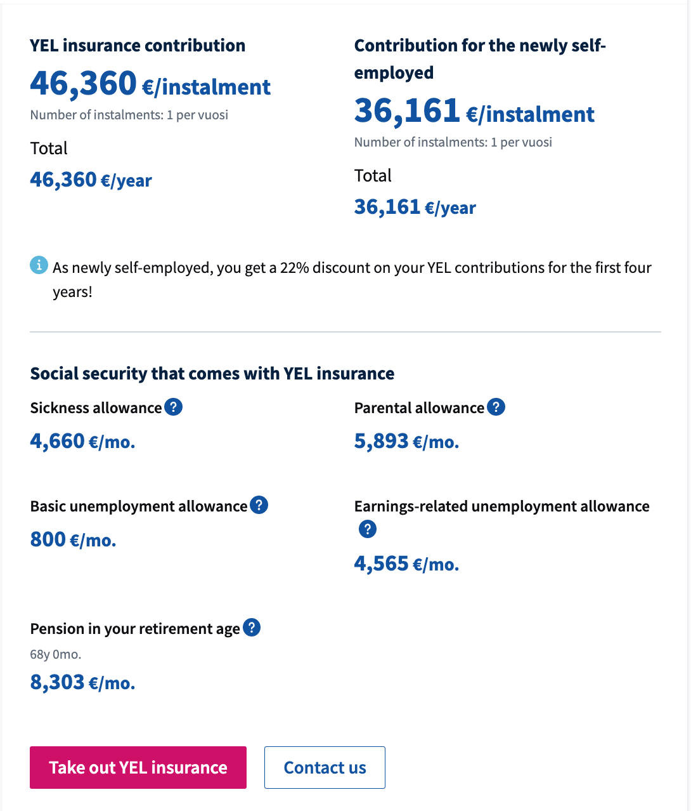

# Freelancing in Finland

<!-- ALL-CONTRIBUTORS-BADGE:START - Do not remove or modify this section -->

<!-- ALL-CONTRIBUTORS-BADGE:END -->

Everything you need to know to start freelancing in Finland as a software developer ✨

<!-- vim-markdown-toc GFM -->

* [Introduction](#introduction)
  * [What problem will you face without this guide?](#what-problem-will-you-face-without-this-guide)
  * [How can this guide solve the problem?](#how-can-this-guide-solve-the-problem)
* [Preparation - what to do **before** you establish your company](#preparation---what-to-do-before-you-establish-your-company)
  * [Know how to handle your upcoming new immigration status](#know-how-to-handle-your-upcoming-new-immigration-status)
  * [Network with freelance brokers and organizations](#network-with-freelance-brokers-and-organizations)
  * [Apply for startup grant](#apply-for-startup-grant)
  * [Quit your job](#quit-your-job)
  * [Establish your company](#establish-your-company)
  * [Apply for general housing allowance](#apply-for-general-housing-allowance)
* [Foundation - what to do **after** you establish your company](#foundation---what-to-do-after-you-establish-your-company)
  * [Open a business bank account](#open-a-business-bank-account)
  * [Find an accountant](#find-an-accountant)
  * [Buy social security insurance YEL](#buy-social-security-insurance-yel)
  * [Consider buying corporate liability insurance](#consider-buying-corporate-liability-insurance)
  * [Consider joining a union](#consider-joining-a-union)
  * [Consider joining an unemployment fund](#consider-joining-an-unemployment-fund)
* [Operation - what to do to **run** your company](#operation---what-to-do-to-run-your-company)
  * [Ensure that your obligations are fulfilled continuously](#ensure-that-your-obligations-are-fulfilled-continuously)
  * [References](#references)
* [Contributors](#contributors)

<!-- vim-markdown-toc -->

## Introduction

### What problem will you face without this guide?

**Losing an estimated 200 hours** figuring out how to do everything by your own. I know this because that's how much I had to spend myself.

In Finland, there are many extensive guides by authorities which have precise information about everything you need to know.
The problem is, however, that the **target audience of those guides are the general population** and out of every 100 pages, maybe 10 pages are relevant to your situation.

For myself, I had questions like:

* How to get freelance projects without any network of my own?
* What you need to do _before_ you establish your company to be eligible for government grants?
* When you setup your company, what are your recurring _obligations_?

Figuring those questions out was tiring and very time consuming.

### How can this guide solve the problem?

By **narrowing down the target audience** to the person reading this guide on Github, you wouldn't lose the time I lost.

You are the target audience of this guide if:

* You are already living in Finland for more than 3 months
* You are already working as a software developer
* You want to work as an independent freelance software developer
* You want to establish a limited liability company to offer your freelance services through it

## Preparation - what to do **before** you establish your company

### Know how to handle your upcoming new immigration status

**Source of truth**: [Finnish Immigration Service](https://migri.fi/en/)

**What is it?** Once you start working as a `self-employed` person, you may need to apply for a different type of residence permit.

**If you're a Finnish citizen**, this is not applicable to you.

**If you're a EU citizen**, as the target audience of this guide is people who are already living in Finland for more than 3 months,
given that you have already [registered your right of residene](https://migri.fi/en/registration-of-right-of-residence),
you don't need to apply for another permit.

**If you're a non-EU citizen**, depending on your current permit, you may need to apply for another permit.

* If you have a permanent residence permit, you don't need to apply for another permit.
* If you have any other type of permit, I don't know. Do you know? Please send a pull request 💯

### Network with freelance brokers and organizations

**What is it?** To find a project that you like, there are companies that can help you with that.
Most require a meeting before they let you in their network. It's always a relaxed meeting, though, as you will be _partners_ who will help each other.

**How does it work?** They find you a project. They add around 5-20% to your hourly rate. You invoice them. They invoice the end client.

**What happens in the meeting?**

* They ask if you know their company and depending on that, they introduce you accordingly.
* They ask about your story.
* They ask if there's an industry that you particularly like/dislike to work in.
* They ask about your hourly rate.

**What about hourly rate?** In Helsinki, if we put aside particular situations in which the client has become dependent on a single point of failure developer,
or other extraordinary situations, in an average project with an average client with an average developer, I've heard companies charging their clients between
90-130€ per hour depending on the strength of their brand, the experience of the developers in the team, and the particular relationship with that client.
In extraordinary situations, I've heard of 150-200€ per hour.

However, the ranges above are for direct company-to-client sales. If you get connected to a client using an intermediary broker company, the ranges will be cut
by 5-20%, which would be their cut of the hourly rate. This means that, with one intermediary company, you're looking at 65-105€ per hour in non-extraordinary situations.

**List of brokers**:
* Fika ☕️ with [Talented](https://talented.fi/for-talents/) and get into their Slack and Hub.
* Fika ☕️ with [Tentimes](https://www.tentimesagency.com/) and get into their Slack.
* Fika ☕️ with [Finitec](https://finitec.fi/) and get into their network.
* Fika ☕️ with [Siili One](https://campaign.siili.com/one) and get into their network.
* Register a profile with [EWork Group](https://supplier.eworkgroup.com/) to be able to apply to their projects.

**List of aggregate sites**:
* Create a [job search alert](https://www.linkedin.com/jobs/) on LinkedIn with:
  * Your `location`
  * Your most important `skill` (Python, for example)
  * Job type as `Contract`
* Create a profile on [Nordgigs](https://nordgigs.com/) which aggregates freelance projects across Nordic countries and email you on a match with your `skill` tags.

**List of organizations you can introduce yourself to**:
* [Business Finland](https://www.businessfinland.fi/en/for-finnish-customers/contact-us/) is a governmental organization whose main purpose is to help Finnish companies.
A lot of those companies are startups who need software developers. By introducing yourself and your services to a Business Finland advisor, they may be able to connect you with potential startups.
* [NewCo Helsinki](https://newcohelsinki.fi/en/startup-services/) is a governmental organization which is focused on helping companies in Helsinki:

  > When problems come up, we are here to help you right away. Please contact us at startup@hel.fi and stop by!

  NewCo Helsinki advisors see many startups in Helsinki who would need software developers. By visiting them and introducing yourself, they might be able to connect you with potential Helsinki startups.

### Apply for startup grant

**Source of truth**: [TE-services startup grant page](https://www.te-palvelut.fi/te/en/employers/for_entrepreneurs/services_new_entrepreneurs/startup_grant/index.html)

**What is it?** Startup grant is a program to support you to become an entrepreneur.
You will receive the monthly payment for a total of 6 months (if you apply once) or a total of 12 months (if you apply for extension as well).

**How much?** ~705€ per month, as personal income. If your income tax is 25%, for example, you will get ~525€.

**Steps** for first application:

* You will be disqualified from startup grant if you have already established your company or started full-time entrepreneurship.

* You need a business plan and certain financial calculations as an attachment to your application.
You can use [My Enterprise Finland](https://oma.yrityssuomi.fi/#) and complete the steps for `Business plan` to
draw up your business plan which includes all necessary financial calculations as well.

* Once you have your business plan ready, as an **optional** step, you can send an email with your business plan attached to the
[Enterprise Agency in your city](https://www.uusyrityskeskus.fi/yritysneuvonta/uusyrityskeskukset/) and ask them for an appointment with a _Business Advisor_.
In Helsinki, [_NewCo Helsinki_](https://newcohelsinki.fi/en/) is the Enterprise Agency to go to. Although it is not mandatory to go to this appointment for getting startup grant,
the _Business Advisor_ has seen hundreds of business plans and can guide you to correct your mistakes in the business plan and therefore increase your chances for a successful application.

* You need an updated Resumé as an attachment to your application.

* You need a [tax debt certificate](https://www.vero.fi/en/About-us/contact-us/efil/information-on-mytax/how-to-request-a-tax-debt-certificate-in-mytax/) as an attachment to your application.

* In your business plan, you have specified how much **own funding** you have available to you.
You need to provide a proof of your claimed own funding as an attachment to your application.
This proof doesn't have to be official. I personally printed a pdf from my netbank account overview and that was enough for a successful application.
Also, the amount of money available to you, no matter how high, does not influence the decision of TE-services negatively.

* Apply for startup grant [electronically](https://asiointi.mol.fi/omaasiointi/?kieli=fi) (only available in Finnish)
and you will get an electronic decision within 2 weeks (official estimation). Official decision letter should arrive by post soon after the decision is served (~1 week).

**Steps** for  application extension:

* I don't know. Do you know? Please send a pull request 💯

### Quit your job

**What is it?** The positive decision to your startup grant is on the condition that you will quit your job and become a full-time entrepreneur.

**Steps**:
* **Terminology**: `employee` and `self-employed` are two different terms and they cannot be used interchangeably.
* As an `employee`, deliver your binding resignation in written form to your employer.
* After that, and from the first day of your startup grant decision, you are `self-employed`.

### Establish your company

**Source of truth**: [Business Information System](https://www.ytj.fi/en/index.html)

**What is it?** You need to establish a *limited liability company* (Oy) to be able to offer your freelance services and **protect your personal assets** from a legal perspective.

This *limited liability* is such an extremely important concept that I encourage you to watch
[Khan Academy video on corporations and limited liability](https://www.khanacademy.org/economics-finance-domain/core-finance/taxes-topic/corporate-taxation/v/corporations-and-limited-liability)
and make an **informed** decision whether going for a private trader (toiminimi) is **really** the course of action you'd like to take.

**TL;DR of video**: Working under your own name as a private trader gives you **unlimited** liability and all your personal assets like your home, car, and personal savings are up for grabs if worst happens.
In case of a limited liability company, the liability is *limited* and the company can declare bankruptcy if worst happens, and your personal assets are immune from the liability of the company.

**How much?** ~275€ for online registration. It's a business cost. Later,
when your company is registered and accounting and bank account are setup,
you can claim this ~275€ back from the company as you paid this money from your *personal* bank account even though it was a *business* cost.

**What is the role of Business Information System?**

* What Finnish Digital Agency (Digi- ja väestötietovirasto) is to you, Business Information System (ytj) is to your company.
* This means that in the same manner that you came to life, in the eye of Finnish authorities, by getting a personal ID (henkilötunnus) from Finnish Digital Agency,
your company will come to life by getting a company ID (Y-tunnus) from Business Information System.
* Similarly, in the same way that you update your personal information like your address after you move apartments in Finnish Digital Agency,
you'll update your company's information in Business Information System if there are changes.
* Business Information System is also the **single place** in which you can communicate with and join/exit various registries by Tax Administraion (Vero) and Finnish Patent and Registration Office (PRH).
  * Tax Administraion maintains:
    * Prepayment register (Ennakkoperintärekisteri), which allows your company to take care of its own taxes.
    * VAT register (Arvonlisäverovelvollisuus), which allows your company to report VAT related matters.
    * Employer register (Työnantajarekisteri), which allows your company to report employee-related matters.
  * Finnish Patent and Registration Office maintains:
    * Trade register (Kaupparekisteri), which stores your company's information.

**Steps**:

* Choose a company name.
  * Search for your chosen name in [Name Checking Service for Companies](https://nimipalvelu.prh.fi/nipa/en)
  * If no exact match or very-similar names were found for your chosen name, then probably it will be accepted in the application process.
  * You will be given 3 fields for company name, so prepare 2 backup names as well in case your primary name cannot be registered.

* Choose your main line of business.
  * Source of truth: [Statistics Finland](https://stat.fi/meta/luokitukset/toimiala/001-2008/index_en.html)
  * Required by Tax Administration.
  * For freelancing, you can choose any from [\[Information and communication > Computer programming, consultancy and related activities\]](https://stat.fi/meta/luokitukset/toimiala/001-2008/62_en.html)
that you feel is most relevant.
  * `62010 Computer programming activities` is common as several freelancing agencies like Futurice and Reaktor have chosen that, so you can go with that as well.

* Get another person's consent to be your *Deputy Member of the Board of Directors*.
  * According to [Limited Liability Companies Act](https://www.finlex.fi/en/laki/kaannokset/2006/en20060624.pdf) in Chapter 6, Section 8.1:
  > There  shall  be  between  one  and  five  regular  Members  of  the  Board  of Directors, unless it is otherwise provided in the Articles of Association. If there are  fewer  than  three  Members,  there  shall be  at  least one  Deputy  Member of the Board of Directors.

  * This means that, for your company to be legally compliant, it must have a *Deputy Member of the Board of Directors* when you are going to be the *only* regular member of Board of Directors as the CEO.
  * Once you get the perosn's consent, get his/her personal ID (henkilötunnus) as you'll need it for establishing the company.

* Decide the registries you'd like your company to be part of:
  * Trade register ✅, as the company cannot come into life without it.
  * Prepayment register ✅, as without it, other companies have to withhold taxes on the amounts they pay you.
  * VAT register ✅, as you can start deducting VAT from things or services you  purchase for your *main line of business*. For example, if you buy a laptop for 2,000€, you'll get ~500€ back (VAT 24%).
  * Employer register ❌, because you don't need it if you're not employing anyone else. The fact that you're employing yourself is irrelevant as you're considered `self-employed`, not an `employee`.
You can join later, once and if you start employing others.

* Establish your company online by filing a *startup notification* at [Business Information System](https://asiointi.ytj.fi/ytjap) (only available in Finnish)
  * You can also give power of attorney in Business Information System to an accountant so that they can establish the company on your behalf.

### Apply for general housing allowance

**Source of truth**: [Kela general housing allowance page](https://www.kela.fi/web/en/general-housing-allowance)

**What is it?** General housing allowance supports you with housing costs.
Based on [Suomi.fi](https://www.suomi.fi/company/starting-a-business/entrepreneurs-everyday-life-and-livelyhood/guide/securing-entrepreneurs-livelihood/housing-allowance-and-basic-social-assistance-for-entrepreneurs):

> As an entrepreneur, you are entitled to the general housing allowance under the same conditions as anyone else.

**How much?** Based on the simplified assumption that your only source of **personal** income is startup grant and you don't live with another person in the same household,
general housing allowance is ~410€ per month, tax free, for a studio in Helsinki. You can use **source of truth** calculator for exact figures.

**What counts as a `self-employed` person's income from Kela's perspective**?

* Your company:
  * is a `legal entity` with a business ID (Y-tunnus)
  * can **act** like a natural person from the perspective of law
  * pays taxes on its **profits** in the form of _corporate taxation_, 20%, once a year
* You:
  * are a `natural person` with a personal ID (Henkilötunnus)
  * are a a natural person from the perspective of law
  * pay taxes on your **income** in the form of _perosnal taxation_, at progressive rates, whenever you receive income
* For the purpose of answering _what counts as a `self-employed` person's income from Kela's perspective_, your company's income is irrelevant.
* Your income is relevant. If you have [YEL](#buy-social-security-insurance-yel):
  * Your `YEL income` is counted as your income, nothing else.
  * You do not need to apply for general housing allowance review unless you change your `YEL income`.
* If you don't have YEL:
  * All your income (salary, benefits, dividends, etc) counts as your income.
  * You need to apply for general housing allowance review if your income increases by 400€ per month.

**Steps**:

* Apply for general housing allowance [electronically](https://asiointi.kela.fi/go_app) (only available in Finnish).
* Mention in application that you have received a positive decision to your startup grant application and you have quit your job.
* Attach your startup grant official decision letter which has come via post to the application.
* Attach your employment certificate which mentions the final date of your employment to the application.
* If you don't have the attachments ready, you can still attach them to the application for ~10 days after sending the application.
* You will receive a decision in ~3 weeks (official estimation).

## Foundation - what to do **after** you establish your company

### Open a business bank account

**What is it?** A business bank account for your company's business activities.

**How much?** ~30€ per month. Base prices might start from ~10€ but in *business* accounts, unlike *personal* accounts,
almost anything that happens in the eco-system of your business will cost you something and will drive the total cost to around ~30€.

**Comparison of services**:

|        | English service | Possibility to open account online | Phone customer service |
| :----- | --------------- | ---------------------------------- | ---------------------- |
| Nordea | ✅               | ✅                                  | ✅                      |
| OP     | ✅               | ❌ (1)                              | ?                      |
| Holvi  | ✅               | ✅                                  | ❌ (2)                  |

1. OP corporate account for limited liability companies have to be
opened [by an appointment](https://www.op.fi/corporate-customers/services-for-entrepreneurs/starting-a-business/open-corporate-account)
2. Holvi phone support is for what Holvi considers [urgent](https://support.holvi.com/hc/en-gb/articles/115005238365-Holvi-s-service-and-support),
which is mainly fraud-related activities, during weekdays. All other inquiries have to be submitted electronically.

### Find an accountant

**What is it?** Having an accountant is <ins>not mandatory by law</ins>. However, as the CEO of your company, the ultimate and final responsibility for correctness of your books
and all your company's tax obligations is on **you**, and <ins>when the law comes to you</ins> in the form of random tax audits carried out by Tax Administration, having had a
good accountant who have corrected your mistakes and fulfilled your company's tax obligations on time, every month, could prevent potential complications with Tax Administration.

**How much?** Varies. Accountants will either charge you hourly or a fixed price, which is based on their estimation of how much time they'll spend per month on your business.
A freelancing company for the target audience of this guide with no other activities will take at least an hour or two of their time,
and if we take a 75€/hour rate, you should expect to pay at least 75-150€ per month.

**List of accountants who offer English services as well**:
* [eAccounting Finland](https://www.eaccounting.fi/en/) -> Jonne Anttila
* [Tili Sydwest](https://www.tilisydwest.fi/en/)
* I don't know any other. Do you know? Please send a pull request 💯

**Steps**:

* Contact your accountant in mind:
  * Explain that your business is about IT freelancing
  * Tell if you have a client already, or expecting one soon
  * Mention your estimated amount of business activity and purchases
  * Mention your bank account provider
* Accountant will take it from there.

### Buy social security insurance YEL

**Source of truth**: [ETK Finnish Center for Pensions](https://www.etk.fi/en/the-pension-system/pension-security/pension-coverage-and-insurance/self-employed/)

**What is it?** YEL is a mandatory social security insurance for `self-employed` persons.
The official name of "Self-Employed Person’s Pensions Act" is **misleading**, as YEL doesn't determine your pension only but your entire social security benefits.

**What is `YEL income` and `YEL contribution`?**

* `YEL income`:
  * Has absolutely nothing to do with your income (salary, benefits, dividends, etc).
  * Is how much **"*coverage*"** in social security you would like to have.
  * You have the freedom to choose between ~8000€ up to ~180,000€ per year.
* `YEL contribution`:
  * Is how much you **pay** for your "*coverage*".
  * Is ~19% of your `YEL income`, which means ~125€ up to ~2820€ per month as a business cost.

Minimum YEL                |  Maximum YEL
:-------------------------:|:-------------------------:
  |  

\* Taken from [Varma.fi YEL calculator](https://www.varma.fi/en/entrepreneur/)

**Steps**:

* You have 6 months from starting self-employment to buy YEL.
* Buy YEL from an YEL insurance provider:
  * [elo](https://www.elo.fi/?sc_lang=en)
  * [varma](https://www.varma.fi/en/)
  * [ilmarinen](https://www.ilmarinen.fi/en/)
  * [veritas](https://www.veritas.fi/en/)
* I don't know if any provider is better than the other. Do you know which one is the best? Please send a pull request 💯

### Consider buying corporate liability insurance

**What is it?** An insurance to cover the potential damages you may cause to your client while freelancing.
For example, if you drop the production database and it would take 5 hours to recover from that mistake, and
your client claims 100,000€ in damages for those 5 hours, corporate liability insurance may cover it.

**When is it necessary?** Even though it's not mandatory by law, it may be mandatory by the contract you'll sign with freelance brokers or the client itself.

**How much?** Insurance companies decide the price based on a number of factors including but not limited to your main line of business and your estimated annual revenue.
I have received offers from ~200€ up to ~500€ per year from different insurance providers.

**Corporate liability insurance providers**:
* if [corporate liability insurance](https://www.if.fi/yritysasiakkaat/vakuutukset/vastuuvakuutukset)
  * Insurance offer available in Finnish, Swedish, and English.
  * Online service available in Finnish, Swedish, and English.
* OP [corporate liability insurance](https://www.op.fi/corporate-customers/insurance/operational-insurance/liability-insurance)
  * Insurance offer available in Finnish and Swedish.
  * Online service available in Finnish and Swedish.
* Lähitapiola [corporate liability insurance](https://www.lahitapiola.fi/yritys/vakuutukset/omaisuus-ja-toiminta/toiminnan-vakuutukset)
  * Insurance offer available in ?
  * Online service available in ?

I don't know if any provider is better than the other. Do you know which one is the best? Please send a pull request 💯

### Consider joining a union

**What is it?** A union is an organization which can offer its members certain services at a much lower price and lobby the interests of its members with relavent authorities.

**How much?** ~200€ per year.

**When is it necessary?** Given the union membership fee, and the 200€ average hourly rate of lawyers in Finland,
if you have 2-4 questions about running your business per year, the membership fee will pay itself back.

For example, I had a question about corporate law, and wanted to know what happens if my Deputy Member of the Board of Directors leaves
the company. I called the union and within 5 minutes, I was talking with a lawyer who knew about corporate law and got my answer.

In addition to that, unions negotiate the `self-employed` interests. For example, from July 2019, you no longer have to put 2500€ initial
capital into the company when establishing a limited liability company. This has been one of the points from
[Business Legislation agenda of Suomen Yrittäjät union](https://www.yrittajat.fi/en/about-federation-finnish-enterprises/fields-influence/business-legislation-598844),
among other points.

**Unions**:
* [Suomen Yrittäjät - Finnish Entrepreneurs](https://www.yrittajat.fi/en)
* [Kauppakamari - Finland chamber of commerce](https://kauppakamari.fi/en/)
  * [Helsinki chamber of commerce](https://helsinki.chamber.fi/en/)

I don't know if there are other unions or which one is better than the other. Do you know which one is the best? Please send a pull request 💯

### Consider joining an unemployment fund

**Source of truth**: [Kela unemployment page](https://www.kela.fi/web/en/unemployment)
and [Unemployment Fund for the self-employed](https://syt.fi/)

**What is it?** There are two types of unemployment benefits:

1. **Basic** unemployment allowance, which is paid by Kela and the amount is the same for everyone, ~700€ per month.
2. **Earnings-related** unemployment allowance, which is paid by *unemployment funds* and the amount for the self-employed people depends on their YEL `income`.

You can only apply for earnings-related unemployment allowance if you're part of an unemployment fund.

**How much?** Depends on your YEL `income`. Unemployment law enforces a higher minimum YEL `income` if you wish to be part of an unemployment fund.
The minimum is ~13,000€ YEL `income`, and with that, membership fee is ~155€ per year.

**When is it necessary?** If you wish to get earnings-related unemployment allowance in case of unemployment.

Note that receiving any kind of unemployment allowance *requires permanent closure of your company* and registering as
a job-seeker to be a full-time employee again, among other things.

**Steps**:
* According to [Federation of Unemployment Funds in Finland (TYJ)](https://www.tyj.fi/en/join-a-fund/membership-fees/), there's only one unemployment fund for the self-employed.
* Join [Unemployment Fund for the self-employed](https://syt.fi/).

## Operation - what to do to **run** your company

### Ensure that your obligations are fulfilled continuously

Tax administration office (Vero):

* **Pay your corporate income tax early** using prepayment register, *non-recurrning* obligation: you can pay your corporate income tax before the company financial year ends, if you want.
That way, you won't have to pay interest if the financial year has ended and you had paid way too little corporate income tax during the financial year.
* **Send VAT reports**, *recurring* obligation: strictly speaking, as the owner of the company, you are responsible to ensure that VAT reports are done every month, not your accountant.
Practically, your accountant assumes responsibility for it and will do it herself/himself, but remember that if your accountant fails to do so, you yourself are responsible.
Therefore, check before the deadlines if the VAT reports have been done.
* **Consider monthly bookkeeping**, *recurring* acitivity: accountants prefer to do it monthly. There's no legal obligation to do it monthly, however.
* **Submit financial statement and corporate income tax return**, *recurring* obligation: after the financial year ends, within 4 months you must submit
a financial statement and corporate income tax return. Your accountant can do this for you.

Business Information System (ytj):

* **File notification of changes to company information**, *non-recurrning* obligation: any changes to company information has to be
notified to Business Information System. For example, if your company's address changes, file a [notification of change](https://www.ytj.fi/en/index/notifications/notificationsofchanges/limitedliabilitycompanies.html).

TE-services:

* **Apply for startup grant payment**, *recurring* obligation: you must apply for startup grant payment retroactively within 2 months after the month you're applying for.
For example, if you're applying for the month of March, you have until end of May to apply.

### References

Guides:
* [Suomi.fi](https://www.suomi.fi/company/)
* [Finnish Enterprise Agencies guide to becoming an Entrepreneur in Finland - 2019](https://www.uusyrityskeskus.fi/wp-content/uploads/2019/05/SUK_perustamisopas2019_ENG_VERKKOON.pdf)

Governmental organizations to provide support for you:
* [NewCo Helsinki](https://newcohelsinki.fi/en/)
* [International House Helsinki](https://www.ihhelsinki.fi/)

## Contributors

Thanks goes to these wonderful people ([emoji key](https://allcontributors.org/docs/en/emoji-key)):

<!-- ALL-CONTRIBUTORS-LIST:START - Do not remove or modify this section -->
<!-- prettier-ignore-start -->
<!-- markdownlint-disable -->
<table>
  <tr>
    <td align="center"><a href="https://andersnylund.com"> <b>Anders Nylund</b></a> <a href="https://github.com/sam-hosseini/freelancing-in-finland/commits?author=andersnylund" title="Documentation">📖</a></td>
  </tr>
</table>

<!-- markdownlint-enable -->
<!-- prettier-ignore-end -->
<!-- ALL-CONTRIBUTORS-LIST:END -->

This project follows the [all-contributors](https://github.com/all-contributors/all-contributors) specification. Contributions of any kind welcome!
